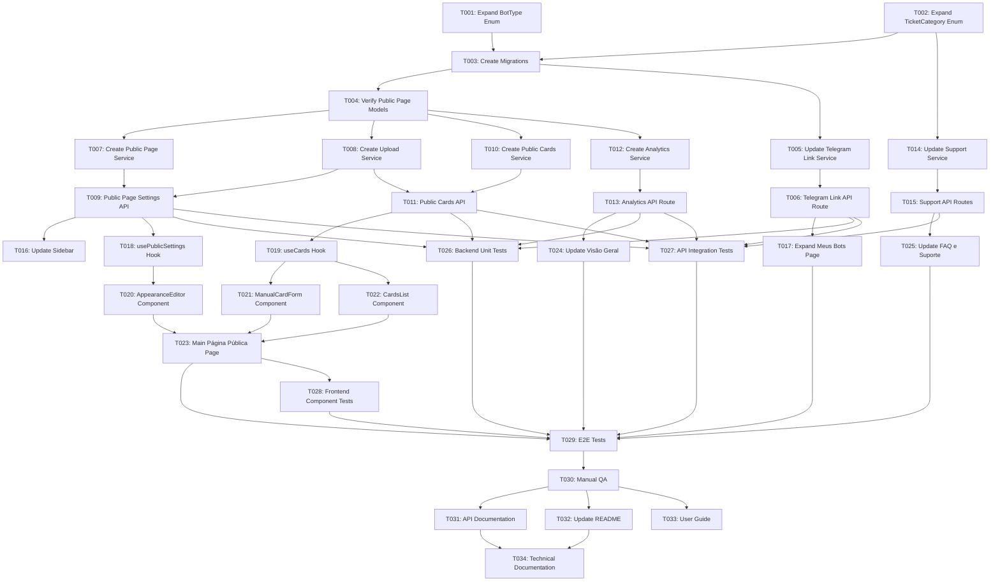

# MILESTONE 2: Dashboard de Gerenciamento (User Interface)

## Metadata

| Field | Value |
|-------|-------|
| **Source Document** | `/MILESTONE_GENERATOR_UTILS/TASK_PINTEREST_E_SUGESTÕES_2.md` |
| **Milestone Type** | Feature Enhancement - User Interface |
| **Estimated Hours** | 80-100 hours |
| **Complexity** | High |
| **Dependencies** | Milestone 1 (Public Page schemas: PublicPageSettings, PublicCard, PublicEvent) |
| **Provides For** | Milestone 3 (Pinterest Bot), Milestone 4 (Suggestion Bot) |
| **Implementation Root** | `implementation/divulga-facil-bot-dashboard/` |

---

## Executive Summary

### Objective

Expand the user dashboard to support two new bots (Pinterest Bot and Suggestion Bot) and provide complete management of the public product showcase page. This milestone delivers the user-facing interface for managing all bot configurations, customizing page appearance, creating/editing product cards manually, viewing analytics, and accessing categorized support.

### What This Milestone Delivers

1. **Extended "Meus Bots" Tab**: Add token generation for Pinterest Bot and Suggestion Bot (4 bots total)
2. **New "Página Pública" Tab**: Complete management interface for public page appearance and product cards
3. **Manual Card CRUD**: Create, edit, list, and hide product cards manually (complementing bot-created cards)
4. **Consolidated Analytics**: Dashboard metrics showing views, clicks, CTR for the public page
5. **Enhanced Support**: FAQ and ticket categorization for new bots and public page features

### Business Value

- **Unified Management**: Single dashboard for all 4 bots (Arts, Download, Pinterest, Suggestions)
- **Full Control**: Users can customize appearance and manually adjust automated content
- **Data Visibility**: Real-time metrics enable data-driven decision making
- **Better Support**: Categorized tickets improve support efficiency

---

## Prerequisites Validation

### Required from Milestone 1

- [ ] Database tables exist: `public_page_settings`, `public_cards`, `public_events`
- [ ] Enums defined: `CardSource`, `Marketplace`, `CardStatus`, `PublicEventType`
- [ ] Public page frontend working at `https://divulgafacil.shop/{slug}`
- [ ] Storage system configured for image uploads (`/uploads/`)

### Infrastructure Requirements

- [ ] PostgreSQL database with `uuid-ossp` extension
- [ ] Node.js environment (Next.js frontend, Express.js backend)
- [ ] Prisma ORM configured
- [ ] JWT authentication middleware functional
- [ ] File upload middleware (multer) available

### Verification Commands

```bash
# Verify database schema
npx prisma db pull

# Verify existing public page models
npx prisma format && grep -A 10 "model public_page_settings" apps/api/prisma/schema.prisma

# Verify authentication middleware
grep -r "requireAuth" apps/api/src/middleware/

# Verify upload directory exists
ls -la public/uploads/
```

---

## Critical Path Analysis

### Phase 1: Database Layer (8-12 hours)

**Critical**: Must complete before API development

1. Expand `BotType` enum (PINTEREST, SUGGESTION)
2. Expand `TicketCategory` enum (BOT_PINTEREST, BOT_SUGGESTION, PUBLIC_PAGE)
3. Create and apply migrations
4. Verify enum constraints

### Phase 2: Backend API (20-28 hours)

**Dependencies**: Phase 1 complete

1. Telegram link service (support new bot types)
2. Public page settings API (GET/PATCH)
3. Public cards API (POST/GET/PATCH/DELETE) - verify Milestone 1 implementation
4. Analytics aggregation service
5. Support ticket creation (expanded categories)

### Phase 3: Frontend Components (32-40 hours)

**Dependencies**: Phase 2 API routes functional

1. Sidebar navigation (add "Página Pública" link)
2. "Meus Bots" page expansion (2 new bot cards)
3. New "Página Pública" page with 3 sections:
   - Appearance editor
   - Manual card form
   - Cards list with edit/delete
4. "Visão Geral" dashboard (new KPIs)
5. "FAQ e Suporte" expansion

### Phase 4: Integration & Testing (12-16 hours)

**Dependencies**: Phases 1-3 complete

1. Unit tests for services
2. Integration tests for API endpoints
3. E2E tests for critical flows
4. Manual QA of UI flows

### Phase 5: Documentation (4-6 hours)

1. Update API documentation
2. Update README with new features
3. Create user guide screenshots

### Total Duration Estimate

- **Optimistic**: 76 hours (3-4 weeks with 1 developer)
- **Realistic**: 90 hours (4-5 weeks with 1 developer)
- **Pessimistic**: 102 hours (5-6 weeks with 1 developer)

---

## Task Summary

| Phase | Sequential Tasks | Parallel Tasks | Total Tasks | Hours |
|-------|------------------|----------------|-------------|-------|
| Database Layer | 4 | 0 | 4 | 10 |
| Backend API | 8 | 6 | 14 | 24 |
| Frontend Components | 4 | 12 | 16 | 36 |
| Integration & Testing | 2 | 6 | 8 | 14 |
| Documentation | 1 | 3 | 4 | 6 |
| **TOTAL** | **19** | **27** | **46** | **90** |

---

## Detailed Task List

### PHASE 1: DATABASE LAYER

---

#### T001: Expand BotType Enum in Prisma Schema

**Type**: SEQUENTIAL

**Dependencies**: None

**Estimated Hours**: 2

**Objective**: Add PINTEREST and SUGGESTION values to BotType enum to support the two new bots.

**Files to Modify**:
- `/apps/api/prisma/schema.prisma`

**Implementation Steps**:

1. Locate the `BotType` enum (if it doesn't exist, it needs to be created based on telegram_bot_links.bot_type)
2. Add enum definition:

```prisma
enum BotType {
  ARTS
  DOWNLOAD
  PINTEREST    // NEW
  SUGGESTION   // NEW
}
```

3. Update `telegram_bot_links` model to use enum:

```prisma
model telegram_bot_links {
  id               String   @id @default(dbgenerated("uuid_generate_v4()")) @db.Uuid
  user_id          String   @db.Uuid
  bot_type         BotType  @map("bot_type")  // Changed from String to BotType
  telegram_user_id String   @db.VarChar(100)
  chat_id          String   @db.VarChar(100)
  linked_at        DateTime? @default(now()) @db.Timestamptz(6)
  users            User     @relation(fields: [user_id], references: [id], onDelete: Cascade)

  @@unique([user_id, bot_type], map: "user_id_bot_type")
  @@index([user_id], map: "idx_telegram_bot_links_user_id")
  @@map("telegram_bot_links")
}
```

4. Update `telegram_links` model similarly if needed

**Deliverables**:
- Updated schema.prisma with BotType enum
- Models using the enum type

**Validation**:
```bash
npx prisma format
npx prisma validate
```

---

#### T002: Expand TicketCategory Enum in Prisma Schema

**Type**: SEQUENTIAL

**Dependencies**: None

**Estimated Hours**: 2

**Objective**: Add support ticket categories for new bots and public page features.

**Files to Modify**:
- `/apps/api/prisma/schema.prisma`

**Implementation Steps**:

1. Create or expand `TicketCategory` enum:

```prisma
enum TicketCategory {
  GENERAL
  BILLING
  TECHNICAL
  BOT_ARTS
  BOT_DOWNLOAD
  BOT_PINTEREST    // NEW
  BOT_SUGGESTION   // NEW
  PUBLIC_PAGE      // NEW
}
```

2. Update `support_tickets` model to use enum:

```prisma
model support_tickets {
  id          String         @id @default(dbgenerated("uuid_generate_v4()")) @db.Uuid
  user_id     String         @db.Uuid
  category    TicketCategory // Enum type
  priority    String         @db.VarChar(50)
  status      String         @default("OPEN") @db.VarChar(50)
  subject     String         @db.VarChar(200)
  description String         @db.Text
  created_at  DateTime       @default(now()) @db.Timestamptz(6)
  updated_at  DateTime       @updatedAt @db.Timestamptz(6)
  user        User           @relation(fields: [user_id], references: [id], onDelete: Cascade)

  @@index([user_id], map: "idx_support_tickets_user_id")
  @@index([category], map: "idx_support_tickets_category")
  @@index([status], map: "idx_support_tickets_status")
  @@map("support_tickets")
}
```

**Deliverables**:
- TicketCategory enum defined
- support_tickets model using enum
- Indexes on category field

**Validation**:
```bash
npx prisma format
npx prisma validate
```

---

#### T003: Create and Apply Database Migrations

**Type**: SEQUENTIAL

**Dependencies**: T001, T002

**Estimated Hours**: 3

**Objective**: Generate and apply Prisma migrations for the enum changes.

**Files to Create**:
- `/apps/api/prisma/migrations/YYYYMMDDHHMMSS_expand_bot_types/migration.sql`
- `/apps/api/prisma/migrations/YYYYMMDDHHMMSS_expand_support_categories/migration.sql`

**Implementation Steps**:

1. Generate migration for BotType enum:

```bash
cd apps/api
npx prisma migrate dev --name expand_bot_types
```

2. Review the generated migration SQL. If the bot_type column is currently a string, manually edit the migration to:

```sql
-- Create enum if not exists
CREATE TYPE "BotType" AS ENUM ('ARTS', 'DOWNLOAD', 'PINTEREST', 'SUGGESTION');

-- If column already exists as varchar, convert it
ALTER TABLE "telegram_bot_links"
  ALTER COLUMN "bot_type" TYPE "BotType"
  USING "bot_type"::text::"BotType";

ALTER TABLE "telegram_links"
  ALTER COLUMN "bot_type" TYPE "BotType"
  USING "bot_type"::text::"BotType";
```

3. Generate migration for TicketCategory enum:

```bash
npx prisma migrate dev --name expand_support_categories
```

4. Review the generated migration SQL:

```sql
-- Create enum
CREATE TYPE "TicketCategory" AS ENUM (
  'GENERAL',
  'BILLING',
  'TECHNICAL',
  'BOT_ARTS',
  'BOT_DOWNLOAD',
  'BOT_PINTEREST',
  'BOT_SUGGESTION',
  'PUBLIC_PAGE'
);

-- Convert column if needed
ALTER TABLE "support_tickets"
  ALTER COLUMN "category" TYPE "TicketCategory"
  USING "category"::text::"TicketCategory";
```

5. Apply migrations to database:

```bash
npx prisma migrate deploy
```

6. Regenerate Prisma Client:

```bash
npx prisma generate
```

**Deliverables**:
- Migration files in prisma/migrations/
- Database updated with new enum values
- Prisma Client regenerated

**Validation**:
```bash
# Check migration status
npx prisma migrate status

# Verify enums in database
psql $DATABASE_URL -c "\dT+ BotType"
psql $DATABASE_URL -c "\dT+ TicketCategory"
```

---

#### T004: Verify Milestone 1 Public Page Models

**Type**: SEQUENTIAL

**Dependencies**: T003

**Estimated Hours**: 3

**Objective**: Confirm that Milestone 1 public page models (PublicPageSettings, PublicCard, PublicEvent) exist and are correct. If missing, implement them.

**Files to Verify/Create**:
- `/apps/api/prisma/schema.prisma`

**Implementation Steps**:

1. Check if `public_page_settings` model exists:

```prisma
model public_page_settings {
  id               String   @id @default(dbgenerated("uuid_generate_v4()")) @db.Uuid
  user_id          String   @unique @db.Uuid
  public_slug      String   @unique @db.VarChar(30)
  display_name     String   @db.VarChar(100)
  header_color     String   @default("#FF006B") @db.VarChar(7)
  header_image_url String   @default("/logo-bot-bg.png") @db.VarChar(500)
  bio              String?  @db.VarChar(500)
  created_at       DateTime @default(now()) @db.Timestamptz(6)
  updated_at       DateTime @updatedAt @db.Timestamptz(6)

  user         User           @relation(fields: [user_id], references: [id], onDelete: Cascade)
  public_cards public_cards[]

  @@index([public_slug], map: "idx_public_page_settings_slug")
  @@map("public_page_settings")
}
```

2. Check if `public_cards` model exists:

```prisma
model public_cards {
  id                 String             @id @default(dbgenerated("uuid_generate_v4()")) @db.Uuid
  user_id            String             @db.Uuid
  card_slug          String             @unique @db.VarChar(100)
  source             CardSource         @default(BOT)
  marketplace        Marketplace
  title              String             @db.VarChar(200)
  description        String?            @db.Text
  price              String             @db.VarChar(50)
  original_price     String?            @db.VarChar(50)
  image_url          String             @db.VarChar(500)
  affiliate_url      String             @db.VarChar(1000)
  coupon             String?            @db.VarChar(100)
  category           String             @db.VarChar(100)
  status             CardStatus         @default(ACTIVE)
  created_at         DateTime           @default(now()) @db.Timestamptz(6)
  updated_at         DateTime           @updatedAt @db.Timestamptz(6)

  user               User               @relation(fields: [user_id], references: [id], onDelete: Cascade)
  public_page        public_page_settings @relation(fields: [user_id], references: [user_id])
  public_events      public_events[]

  @@index([user_id], map: "idx_public_cards_user_id")
  @@index([card_slug], map: "idx_public_cards_slug")
  @@index([status], map: "idx_public_cards_status")
  @@index([marketplace], map: "idx_public_cards_marketplace")
  @@map("public_cards")
}
```

3. Check if `public_events` model exists:

```prisma
model public_events {
  id           String          @id @default(dbgenerated("uuid_generate_v4()")) @db.Uuid
  user_id      String          @db.Uuid
  card_id      String?         @db.Uuid
  event_type   PublicEventType
  ip_address   String?         @db.VarChar(45)
  user_agent   String?         @db.VarChar(500)
  referrer     String?         @db.VarChar(1000)
  metadata     Json?
  created_at   DateTime        @default(now()) @db.Timestamptz(6)

  user         User            @relation(fields: [user_id], references: [id], onDelete: Cascade)
  card         public_cards?   @relation(fields: [card_id], references: [id], onDelete: Cascade)

  @@index([user_id], map: "idx_public_events_user_id")
  @@index([card_id], map: "idx_public_events_card_id")
  @@index([event_type], map: "idx_public_events_type")
  @@index([created_at], map: "idx_public_events_created_at")
  @@map("public_events")
}
```

4. If any model is missing, create migration:

```bash
npx prisma migrate dev --name add_public_page_models
```

5. Generate Prisma Client:

```bash
npx prisma generate
```

**Deliverables**:
- Verified or created public page models
- Migration applied if needed
- Prisma Client updated

**Validation**:
```bash
# Verify tables exist
psql $DATABASE_URL -c "\dt public_*"
```

---

### PHASE 2: BACKEND API

---

#### T005: Update Telegram Link Service for New Bot Types

**Type**: SEQUENTIAL

**Dependencies**: T003

**Estimated Hours**: 3

**Objective**: Extend the existing TelegramLinkService to support PINTEREST and SUGGESTION bot types.

**Files to Modify**:
- `/apps/api/src/services/telegram-link.service.ts`
- `/apps/api/src/types/telegram.types.ts` (if exists)

**Implementation Steps**:

1. Create/update types file:

```typescript
// apps/api/src/types/telegram.types.ts
export enum BotType {
  ARTS = 'ARTS',
  DOWNLOAD = 'DOWNLOAD',
  PINTEREST = 'PINTEREST',
  SUGGESTION = 'SUGGESTION',
}

export interface TelegramLink {
  token: string;
  botType: BotType;
  expiresAt: Date;
  instructions: string;
}
```

2. Update service to accept new bot types:

```typescript
// apps/api/src/services/telegram-link.service.ts
import { BotType } from '../types/telegram.types';
import { prisma } from '../lib/prisma';
import crypto from 'crypto';

export class TelegramLinkService {
  /**
   * Generate a 10-digit token for bot linking
   */
  static async generateLink(userId: string, botType: BotType): Promise<TelegramLink> {
    // Validate bot type
    if (!Object.values(BotType).includes(botType)) {
      throw new Error('Invalid bot type');
    }

    // Generate 10-digit numeric token
    const token = crypto.randomInt(1000000000, 9999999999).toString();

    // Token expires in 10 minutes
    const expiresAt = new Date(Date.now() + 10 * 60 * 1000);

    // Store in telegram_links table
    await prisma.telegram_links.create({
      data: {
        user_id: userId,
        bot_type: botType,
        token_hash: token, // In production, hash this
        expires_at: expiresAt,
      },
    });

    // Generate instructions based on bot type
    const botNames = {
      ARTS: '@DivulgaFacilArtsBot',
      DOWNLOAD: '@DivulgaFacilDownloadBot',
      PINTEREST: '@DivulgaFacilPinterestBot',
      SUGGESTION: '@DivulgaFacilSuggestionBot',
    };

    return {
      token,
      botType,
      expiresAt,
      instructions: `Envie /codigo ${token} no bot ${botNames[botType]} no Telegram`,
    };
  }

  /**
   * Validate token and link bot to user
   */
  static async validateAndLink(
    token: string,
    botType: BotType,
    telegramUserId: string,
    chatId: string
  ): Promise<boolean> {
    // Find valid token
    const linkToken = await prisma.telegram_links.findFirst({
      where: {
        token_hash: token,
        bot_type: botType,
        expires_at: {
          gte: new Date(),
        },
        used_at: null,
      },
    });

    if (!linkToken) {
      return false;
    }

    // Create bot link
    await prisma.telegram_bot_links.upsert({
      where: {
        user_id_bot_type: {
          user_id: linkToken.user_id,
          bot_type: botType,
        },
      },
      create: {
        user_id: linkToken.user_id,
        bot_type: botType,
        telegram_user_id: telegramUserId,
        chat_id: chatId,
      },
      update: {
        telegram_user_id: telegramUserId,
        chat_id: chatId,
        linked_at: new Date(),
      },
    });

    // Mark token as used
    await prisma.telegram_links.update({
      where: { id: linkToken.id },
      data: { used_at: new Date() },
    });

    return true;
  }
}
```

**Deliverables**:
- Updated TelegramLinkService supporting 4 bot types
- Type definitions for BotType enum
- Token generation and validation logic

**Tests to Create**:
```typescript
// apps/api/src/services/__tests__/telegram-link.service.test.ts
describe('TelegramLinkService', () => {
  it('should generate token for PINTEREST bot', async () => {
    const link = await TelegramLinkService.generateLink('user-id', BotType.PINTEREST);
    expect(link.token).toHaveLength(10);
    expect(link.botType).toBe(BotType.PINTEREST);
  });

  it('should generate token for SUGGESTION bot', async () => {
    const link = await TelegramLinkService.generateLink('user-id', BotType.SUGGESTION);
    expect(link.token).toHaveLength(10);
    expect(link.botType).toBe(BotType.SUGGESTION);
  });

  it('should reject invalid bot type', async () => {
    await expect(
      TelegramLinkService.generateLink('user-id', 'INVALID' as any)
    ).rejects.toThrow('Invalid bot type');
  });
});
```

---

#### T006: Create Telegram Link API Route

**Type**: SEQUENTIAL

**Dependencies**: T005

**Estimated Hours**: 2

**Objective**: Create/update API endpoint for generating bot linking tokens.

**Files to Create/Modify**:
- `/apps/api/src/routes/telegram.routes.ts`
- `/apps/api/src/middleware/auth.middleware.ts` (verify exists)

**Implementation Steps**:

1. Create route file:

```typescript
// apps/api/src/routes/telegram.routes.ts
import { Router } from 'express';
import { z } from 'zod';
import { requireAuth } from '../middleware/auth.middleware';
import { TelegramLinkService } from '../services/telegram-link.service';
import { BotType } from '../types/telegram.types';

const router = Router();

const generateLinkSchema = z.object({
  botType: z.nativeEnum(BotType),
});

/**
 * POST /api/telegram/generate-link
 * Generate a linking token for a bot
 */
router.post('/generate-link', requireAuth, async (req, res) => {
  try {
    const { botType } = generateLinkSchema.parse(req.body);
    const userId = req.auth!.userId;

    const link = await TelegramLinkService.generateLink(userId, botType);

    res.json({
      link: {
        token: link.token,
        botType: link.botType,
        expiresAt: link.expiresAt.toISOString(),
        instructions: link.instructions,
      },
    });
  } catch (error) {
    if (error instanceof z.ZodError) {
      return res.status(400).json({
        error: 'Invalid bot type',
        validTypes: Object.values(BotType),
      });
    }
    console.error('Error generating link:', error);
    res.status(500).json({ error: 'Internal server error' });
  }
});

export default router;
```

2. Register route in main app:

```typescript
// apps/api/src/app.ts or index.ts
import telegramRoutes from './routes/telegram.routes';

app.use('/api/telegram', telegramRoutes);
```

**Deliverables**:
- Telegram routes with token generation endpoint
- Zod validation for bot type
- Proper error handling

**Tests to Create**:
```typescript
// apps/api/src/routes/__tests__/telegram.routes.test.ts
describe('POST /api/telegram/generate-link', () => {
  it('should generate link for authenticated user', async () => {
    const response = await request(app)
      .post('/api/telegram/generate-link')
      .set('Authorization', `Bearer ${validToken}`)
      .send({ botType: 'PINTEREST' })
      .expect(200);

    expect(response.body.link.token).toBeDefined();
    expect(response.body.link.botType).toBe('PINTEREST');
  });

  it('should reject unauthenticated requests', async () => {
    await request(app)
      .post('/api/telegram/generate-link')
      .send({ botType: 'PINTEREST' })
      .expect(401);
  });

  it('should reject invalid bot type', async () => {
    await request(app)
      .post('/api/telegram/generate-link')
      .set('Authorization', `Bearer ${validToken}`)
      .send({ botType: 'INVALID' })
      .expect(400);
  });
});
```

---

#### T007: Create Public Page Settings Service

**Type**: SEQUENTIAL

**Dependencies**: T004

**Estimated Hours**: 4

**Objective**: Create service for managing public page appearance settings.

**Files to Create**:
- `/apps/api/src/services/public-page.service.ts`
- `/apps/api/src/types/pinterest.types.ts`

**Implementation Steps**:

1. Create types:

```typescript
// apps/api/src/types/pinterest.types.ts
export interface PublicPageSettings {
  id: string;
  userId: string;
  publicSlug: string;
  displayName: string;
  headerColor: string;
  headerImageUrl: string;
  bio: string | null;
  createdAt: Date;
  updatedAt: Date;
}

export interface UpdateSettingsDto {
  displayName?: string;
  headerColor?: string;
  headerImageUrl?: string;
  bio?: string | null;
}
```

2. Create service:

```typescript
// apps/api/src/services/public-page.service.ts
import { prisma } from '../lib/prisma';
import { PublicPageSettings, UpdateSettingsDto } from '../types/pinterest.types';

export class PublicPageService {
  /**
   * Get public page settings by user ID
   */
  static async getByUserId(userId: string): Promise<PublicPageSettings | null> {
    const settings = await prisma.public_page_settings.findUnique({
      where: { user_id: userId },
    });

    return settings;
  }

  /**
   * Update public page settings
   */
  static async updateSettings(
    userId: string,
    data: UpdateSettingsDto
  ): Promise<PublicPageSettings> {
    // Validate hex color if provided
    if (data.headerColor && !/^#[0-9A-F]{6}$/i.test(data.headerColor)) {
      throw new Error('Invalid hex color format');
    }

    const settings = await prisma.public_page_settings.update({
      where: { user_id: userId },
      data: {
        display_name: data.displayName,
        header_color: data.headerColor,
        header_image_url: data.headerImageUrl,
        bio: data.bio,
        updated_at: new Date(),
      },
    });

    return settings;
  }

  /**
   * Create default settings for new user
   */
  static async createDefaults(userId: string, email: string): Promise<PublicPageSettings> {
    // Generate unique slug from email
    const baseSlug = email.split('@')[0].toLowerCase().replace(/[^a-z0-9]/g, '-');
    let publicSlug = baseSlug;
    let counter = 1;

    // Ensure uniqueness
    while (await prisma.public_page_settings.findUnique({ where: { public_slug: publicSlug } })) {
      publicSlug = `${baseSlug}-${counter}`;
      counter++;
    }

    const settings = await prisma.public_page_settings.create({
      data: {
        user_id: userId,
        public_slug: publicSlug,
        display_name: email.split('@')[0],
        header_color: '#FF006B',
        header_image_url: '/logo-bot-bg.png',
      },
    });

    return settings;
  }
}
```

**Deliverables**:
- PublicPageService with CRUD operations
- Type definitions for settings
- Validation for hex colors
- Unique slug generation

**Tests to Create**:
```typescript
// apps/api/src/services/__tests__/public-page.service.test.ts
describe('PublicPageService', () => {
  it('should get settings by user ID', async () => {
    const settings = await PublicPageService.getByUserId('user-id');
    expect(settings).toBeDefined();
  });

  it('should update settings', async () => {
    const updated = await PublicPageService.updateSettings('user-id', {
      displayName: 'New Name',
      headerColor: '#123456',
    });
    expect(updated.display_name).toBe('New Name');
    expect(updated.header_color).toBe('#123456');
  });

  it('should reject invalid hex color', async () => {
    await expect(
      PublicPageService.updateSettings('user-id', { headerColor: 'red' })
    ).rejects.toThrow('Invalid hex color format');
  });
});
```

---

#### T008: Create Upload Service for Image Handling

**Type**: PARALLEL-GROUP-1

**Dependencies**: T004

**Estimated Hours**: 4

**Objective**: Create service for handling image uploads (header images and card images).

**Files to Create**:
- `/apps/api/src/services/upload.service.ts`
- `/apps/api/src/utils/image-processor.ts`

**Implementation Steps**:

1. Install dependencies (if not already installed):

```bash
npm install sharp multer
npm install -D @types/multer @types/sharp
```

2. Create image processor utility:

```typescript
// apps/api/src/utils/image-processor.ts
import sharp from 'sharp';
import fs from 'fs/promises';
import path from 'path';
import crypto from 'crypto';

export class ImageProcessor {
  private static UPLOAD_DIR = path.join(process.cwd(), 'public', 'uploads');

  /**
   * Resize and save header image (max 1200x300)
   */
  static async processHeaderImage(file: Express.Multer.File): Promise<string> {
    const filename = `header-${crypto.randomUUID()}.jpg`;
    const outputPath = path.join(this.UPLOAD_DIR, 'headers', filename);

    await fs.mkdir(path.dirname(outputPath), { recursive: true });

    await sharp(file.path)
      .resize(1200, 300, {
        fit: 'cover',
        position: 'center',
      })
      .jpeg({ quality: 85 })
      .toFile(outputPath);

    // Delete temp file
    await fs.unlink(file.path);

    return `/uploads/headers/${filename}`;
  }

  /**
   * Resize and save card image (max 800x800)
   */
  static async processCardImage(file: Express.Multer.File): Promise<string> {
    const filename = `card-${crypto.randomUUID()}.jpg`;
    const outputPath = path.join(this.UPLOAD_DIR, 'cards', filename);

    await fs.mkdir(path.dirname(outputPath), { recursive: true });

    await sharp(file.path)
      .resize(800, 800, {
        fit: 'cover',
        position: 'center',
      })
      .jpeg({ quality: 85 })
      .toFile(outputPath);

    // Delete temp file
    await fs.unlink(file.path);

    return `/uploads/cards/${filename}`;
  }

  /**
   * Validate image file
   */
  static validateImage(file: Express.Multer.File, maxSizeMB: number): void {
    const allowedTypes = ['image/jpeg', 'image/png'];

    if (!allowedTypes.includes(file.mimetype)) {
      throw new Error('Invalid file type. Only JPEG and PNG are allowed.');
    }

    const maxSizeBytes = maxSizeMB * 1024 * 1024;
    if (file.size > maxSizeBytes) {
      throw new Error(`File too large. Maximum size is ${maxSizeMB}MB.`);
    }
  }
}
```

3. Create upload service:

```typescript
// apps/api/src/services/upload.service.ts
import { ImageProcessor } from '../utils/image-processor';

export class UploadService {
  /**
   * Upload and process header image
   */
  static async uploadHeaderImage(file: Express.Multer.File): Promise<string> {
    ImageProcessor.validateImage(file, 2); // Max 2MB
    return await ImageProcessor.processHeaderImage(file);
  }

  /**
   * Upload and process card image
   */
  static async uploadCardImage(file: Express.Multer.File): Promise<string> {
    ImageProcessor.validateImage(file, 5); // Max 5MB
    return await ImageProcessor.processCardImage(file);
  }
}
```

**Deliverables**:
- UploadService for image handling
- ImageProcessor utility with sharp
- Image validation and resizing
- File size limits enforced

---

#### T009: Create Public Page Settings API Routes

**Type**: SEQUENTIAL

**Dependencies**: T007, T008

**Estimated Hours**: 3

**Objective**: Create API endpoints for getting and updating public page settings.

**Files to Create**:
- `/apps/api/src/routes/user/pinterest-settings.routes.ts`

**Implementation Steps**:

1. Create routes file:

```typescript
// apps/api/src/routes/user/pinterest-settings.routes.ts
import { Router } from 'express';
import { z } from 'zod';
import multer from 'multer';
import { requireAuth } from '../../middleware/auth.middleware';
import { PublicPageService } from '../../services/public-page.service';
import { UploadService } from '../../services/upload.service';

const router = Router();
const upload = multer({ dest: '/tmp/uploads' });

const updateSettingsSchema = z.object({
  displayName: z.string().max(100).optional(),
  headerColor: z.string().regex(/^#[0-9A-F]{6}$/i).optional(),
  bio: z.string().max(500).nullable().optional(),
});

/**
 * GET /api/user/pinterest/settings
 * Get current user's public page settings
 */
router.get('/settings', requireAuth, async (req, res) => {
  try {
    const userId = req.auth!.userId;
    const settings = await PublicPageService.getByUserId(userId);

    if (!settings) {
      return res.status(404).json({ error: 'Settings not found' });
    }

    res.json({
      settings: {
        ...settings,
        publicUrl: `https://divulgafacil.shop/${settings.public_slug}`,
      },
    });
  } catch (error) {
    console.error('Error fetching settings:', error);
    res.status(500).json({ error: 'Internal server error' });
  }
});

/**
 * PATCH /api/user/pinterest/settings
 * Update public page settings
 */
router.patch('/settings', requireAuth, upload.single('headerImage'), async (req, res) => {
  try {
    const userId = req.auth!.userId;
    const data = updateSettingsSchema.parse(req.body);

    let headerImageUrl: string | undefined;

    // Process uploaded image if present
    if (req.file) {
      headerImageUrl = await UploadService.uploadHeaderImage(req.file);
    }

    const updated = await PublicPageService.updateSettings(userId, {
      ...data,
      headerImageUrl,
    });

    res.json({ settings: updated });
  } catch (error) {
    if (error instanceof z.ZodError) {
      return res.status(400).json({
        error: 'Validation error',
        details: error.errors,
      });
    }
    console.error('Error updating settings:', error);
    res.status(500).json({ error: 'Internal server error' });
  }
});

export default router;
```

2. Register routes in app:

```typescript
// apps/api/src/app.ts
import pinterestSettingsRoutes from './routes/user/pinterest-settings.routes';

app.use('/api/user/pinterest', pinterestSettingsRoutes);
```

**Deliverables**:
- GET /api/user/pinterest/settings endpoint
- PATCH /api/user/pinterest/settings endpoint
- Multipart form data support for image upload
- Zod validation for settings data

**Tests to Create**:
```typescript
// apps/api/src/routes/user/__tests__/pinterest-settings.routes.test.ts
describe('GET /api/user/pinterest/settings', () => {
  it('should return settings for authenticated user', async () => {
    const response = await request(app)
      .get('/api/user/pinterest/settings')
      .set('Authorization', `Bearer ${validToken}`)
      .expect(200);

    expect(response.body.settings).toBeDefined();
    expect(response.body.settings.publicUrl).toContain('divulgafacil.shop');
  });
});

describe('PATCH /api/user/pinterest/settings', () => {
  it('should update settings', async () => {
    const response = await request(app)
      .patch('/api/user/pinterest/settings')
      .set('Authorization', `Bearer ${validToken}`)
      .send({
        displayName: 'My Shop',
        headerColor: '#123456',
      })
      .expect(200);

    expect(response.body.settings.display_name).toBe('My Shop');
  });

  it('should reject invalid hex color', async () => {
    await request(app)
      .patch('/api/user/pinterest/settings')
      .set('Authorization', `Bearer ${validToken}`)
      .send({ headerColor: 'red' })
      .expect(400);
  });
});
```

---

#### T010: Create Public Cards Service

**Type**: PARALLEL-GROUP-1

**Dependencies**: T004

**Estimated Hours**: 5

**Objective**: Create service for CRUD operations on public cards (both bot-created and manual).

**Files to Create**:
- `/apps/api/src/services/public-card.service.ts`
- `/apps/api/src/utils/marketplace-detector.ts`

**Implementation Steps**:

1. Create marketplace detector:

```typescript
// apps/api/src/utils/marketplace-detector.ts
import { Marketplace } from '@prisma/client';

export function detectMarketplaceFromUrl(url: string): Marketplace | null {
  const urlLower = url.toLowerCase();

  if (urlLower.includes('mercadolivre.com') || urlLower.includes('mercadolibre.com')) {
    return 'MERCADO_LIVRE';
  }
  if (urlLower.includes('shopee.com')) {
    return 'SHOPEE';
  }
  if (urlLower.includes('amazon.com')) {
    return 'AMAZON';
  }
  if (urlLower.includes('magazineluiza.com') || urlLower.includes('magalu.com')) {
    return 'MAGALU';
  }

  return null;
}

export function generateCardSlug(marketplace: Marketplace): string {
  const prefix = marketplace.toLowerCase().replace('_', '-');
  const random = Math.random().toString(36).substring(2, 11);
  return `${prefix}-${random}`;
}
```

2. Create card service:

```typescript
// apps/api/src/services/public-card.service.ts
import { prisma } from '../lib/prisma';
import { CardSource, CardStatus, Marketplace } from '@prisma/client';
import { generateCardSlug } from '../utils/marketplace-detector';

export interface CreateCardDto {
  userId: string;
  source: CardSource;
  marketplace: Marketplace;
  title: string;
  description?: string;
  price: string;
  originalPrice?: string;
  imageUrl: string;
  affiliateUrl: string;
  coupon?: string;
  category: string;
}

export interface UpdateCardDto {
  title?: string;
  description?: string;
  price?: string;
  originalPrice?: string;
  imageUrl?: string;
  affiliateUrl?: string;
  coupon?: string;
  category?: string;
  status?: CardStatus;
}

export class PublicCardService {
  /**
   * Create a new public card
   */
  static async createCard(data: CreateCardDto) {
    const cardSlug = generateCardSlug(data.marketplace);

    const card = await prisma.public_cards.create({
      data: {
        user_id: data.userId,
        card_slug: cardSlug,
        source: data.source,
        marketplace: data.marketplace,
        title: data.title,
        description: data.description,
        price: data.price,
        original_price: data.originalPrice,
        image_url: data.imageUrl,
        affiliate_url: data.affiliateUrl,
        coupon: data.coupon,
        category: data.category,
        status: 'ACTIVE',
      },
    });

    return card;
  }

  /**
   * Get all cards for a user with pagination
   */
  static async getCards(
    userId: string,
    options: {
      cursor?: string;
      limit?: number;
      status?: CardStatus;
      source?: CardSource;
      marketplace?: Marketplace;
    } = {}
  ) {
    const limit = Math.min(options.limit || 24, 100);

    const where: any = {
      user_id: userId,
    };

    if (options.status) where.status = options.status;
    if (options.source) where.source = options.source;
    if (options.marketplace) where.marketplace = options.marketplace;

    const items = await prisma.public_cards.findMany({
      where,
      take: limit + 1,
      ...(options.cursor && {
        cursor: { id: options.cursor },
        skip: 1,
      }),
      orderBy: { created_at: 'desc' },
    });

    const hasMore = items.length > limit;
    const cards = hasMore ? items.slice(0, -1) : items;
    const nextCursor = hasMore ? cards[cards.length - 1].id : null;

    // Get stats
    const [total, active, hidden, bySourceCounts] = await Promise.all([
      prisma.public_cards.count({ where: { user_id: userId } }),
      prisma.public_cards.count({ where: { user_id: userId, status: 'ACTIVE' } }),
      prisma.public_cards.count({ where: { user_id: userId, status: 'HIDDEN' } }),
      prisma.public_cards.groupBy({
        by: ['source'],
        where: { user_id: userId },
        _count: true,
      }),
    ]);

    const stats = {
      total,
      active,
      hidden,
      bySource: {
        bot: bySourceCounts.find(s => s.source === 'BOT')?._count || 0,
        manual: bySourceCounts.find(s => s.source === 'MANUAL')?._count || 0,
      },
    };

    return {
      items: cards,
      nextCursor,
      hasMore,
      stats,
    };
  }

  /**
   * Update a card
   */
  static async updateCard(cardId: string, userId: string, data: UpdateCardDto) {
    // Verify ownership
    const card = await prisma.public_cards.findUnique({
      where: { id: cardId },
      select: { user_id: true },
    });

    if (!card || card.user_id !== userId) {
      throw new Error('Card not found or unauthorized');
    }

    const updated = await prisma.public_cards.update({
      where: { id: cardId },
      data: {
        title: data.title,
        description: data.description,
        price: data.price,
        original_price: data.originalPrice,
        image_url: data.imageUrl,
        affiliate_url: data.affiliateUrl,
        coupon: data.coupon,
        category: data.category,
        status: data.status,
        updated_at: new Date(),
      },
    });

    return updated;
  }

  /**
   * Soft delete a card (set status to HIDDEN)
   */
  static async hideCard(cardId: string, userId: string) {
    const card = await prisma.public_cards.findUnique({
      where: { id: cardId },
      select: { user_id: true },
    });

    if (!card || card.user_id !== userId) {
      throw new Error('Card not found or unauthorized');
    }

    await prisma.public_cards.update({
      where: { id: cardId },
      data: {
        status: 'HIDDEN',
        updated_at: new Date(),
      },
    });
  }
}
```

**Deliverables**:
- PublicCardService with full CRUD
- Marketplace detection utility
- Card slug generation
- Ownership verification
- Pagination support

---

#### T011: Create Public Cards API Routes

**Type**: SEQUENTIAL

**Dependencies**: T010, T008

**Estimated Hours**: 4

**Objective**: Create API endpoints for managing public cards.

**Files to Create**:
- `/apps/api/src/routes/user/pinterest-cards.routes.ts`

**Implementation Steps**:

1. Create routes file:

```typescript
// apps/api/src/routes/user/pinterest-cards.routes.ts
import { Router } from 'express';
import { z } from 'zod';
import multer from 'multer';
import { requireAuth } from '../../middleware/auth.middleware';
import { PublicCardService } from '../../services/public-card.service';
import { UploadService } from '../../services/upload.service';
import { detectMarketplaceFromUrl } from '../../utils/marketplace-detector';
import { CardStatus, Marketplace } from '@prisma/client';

const router = Router();
const upload = multer({ dest: '/tmp/uploads' });

const createCardSchema = z.object({
  marketplace: z.nativeEnum(Marketplace).optional(), // Auto-detected if not provided
  title: z.string().min(1).max(200),
  description: z.string().max(5000).optional(),
  price: z.string().min(1).max(50),
  originalPrice: z.string().max(50).optional(),
  affiliateUrl: z.string().url(),
  coupon: z.string().max(100).optional(),
  category: z.string().max(100),
});

const updateCardSchema = createCardSchema.partial();

/**
 * POST /api/user/pinterest/cards
 * Create a new card manually
 */
router.post('/cards', requireAuth, upload.single('image'), async (req, res) => {
  try {
    const userId = req.auth!.userId;
    const data = createCardSchema.parse(req.body);

    if (!req.file) {
      return res.status(400).json({ error: 'Image is required' });
    }

    // Detect marketplace from URL if not provided
    const marketplace = data.marketplace || detectMarketplaceFromUrl(data.affiliateUrl);
    if (!marketplace) {
      return res.status(400).json({ error: 'Could not detect marketplace from URL' });
    }

    // Upload image
    const imageUrl = await UploadService.uploadCardImage(req.file);

    const card = await PublicCardService.createCard({
      userId,
      source: 'MANUAL',
      marketplace,
      title: data.title,
      description: data.description,
      price: data.price,
      originalPrice: data.originalPrice,
      imageUrl,
      affiliateUrl: data.affiliateUrl,
      coupon: data.coupon,
      category: data.category,
    });

    res.status(201).json({ card });
  } catch (error) {
    if (error instanceof z.ZodError) {
      return res.status(400).json({ error: 'Validation error', details: error.errors });
    }
    console.error('Error creating card:', error);
    res.status(500).json({ error: 'Internal server error' });
  }
});

/**
 * GET /api/user/pinterest/cards
 * Get all cards for the user
 */
router.get('/cards', requireAuth, async (req, res) => {
  try {
    const userId = req.auth!.userId;
    const { cursor, limit, status, source, marketplace } = req.query;

    const result = await PublicCardService.getCards(userId, {
      cursor: cursor as string,
      limit: limit ? parseInt(limit as string) : undefined,
      status: status as CardStatus,
      source: source as any,
      marketplace: marketplace as Marketplace,
    });

    res.json(result);
  } catch (error) {
    console.error('Error fetching cards:', error);
    res.status(500).json({ error: 'Internal server error' });
  }
});

/**
 * PATCH /api/user/pinterest/cards/:id
 * Update a card
 */
router.patch('/cards/:id', requireAuth, upload.single('image'), async (req, res) => {
  try {
    const userId = req.auth!.userId;
    const { id } = req.params;
    const data = updateCardSchema.parse(req.body);

    let imageUrl: string | undefined;
    if (req.file) {
      imageUrl = await UploadService.uploadCardImage(req.file);
    }

    const card = await PublicCardService.updateCard(id, userId, {
      ...data,
      imageUrl,
    });

    res.json({ card });
  } catch (error) {
    if (error instanceof z.ZodError) {
      return res.status(400).json({ error: 'Validation error', details: error.errors });
    }
    if (error instanceof Error && error.message.includes('unauthorized')) {
      return res.status(403).json({ error: 'Forbidden' });
    }
    console.error('Error updating card:', error);
    res.status(500).json({ error: 'Internal server error' });
  }
});

/**
 * DELETE /api/user/pinterest/cards/:id
 * Soft delete (hide) a card
 */
router.delete('/cards/:id', requireAuth, async (req, res) => {
  try {
    const userId = req.auth!.userId;
    const { id } = req.params;

    await PublicCardService.hideCard(id, userId);

    res.status(204).send();
  } catch (error) {
    if (error instanceof Error && error.message.includes('unauthorized')) {
      return res.status(403).json({ error: 'Forbidden' });
    }
    console.error('Error deleting card:', error);
    res.status(500).json({ error: 'Internal server error' });
  }
});

export default router;
```

2. Register routes:

```typescript
// apps/api/src/app.ts
import pinterestCardsRoutes from './routes/user/pinterest-cards.routes';

app.use('/api/user/pinterest', pinterestCardsRoutes);
```

**Deliverables**:
- POST /api/user/pinterest/cards (create manual card)
- GET /api/user/pinterest/cards (list with pagination/filters)
- PATCH /api/user/pinterest/cards/:id (update card)
- DELETE /api/user/pinterest/cards/:id (soft delete)

---

#### T012: Create Analytics Service

**Type**: PARALLEL-GROUP-2

**Dependencies**: T004

**Estimated Hours**: 4

**Objective**: Create service to aggregate analytics from public_events table.

**Files to Create**:
- `/apps/api/src/services/analytics.service.ts`

**Implementation Steps**:

```typescript
// apps/api/src/services/analytics.service.ts
import { prisma } from '../lib/prisma';
import { PublicEventType } from '@prisma/client';

export interface AnalyticsOverview {
  period: {
    startDate: Date;
    endDate: Date;
    days: number;
  };
  summary: {
    totalCards: number;
    activeCards: number;
    hiddenCards: number;
    profileViews: number;
    cardViews: number;
    ctaClicks: number;
    conversionRate: number;
  };
  bySource: {
    bot: {
      cards: number;
      views: number;
      clicks: number;
    };
    manual: {
      cards: number;
      views: number;
      clicks: number;
    };
  };
  byMarketplace: Array<{
    marketplace: string;
    cards: number;
    views: number;
    clicks: number;
  }>;
  topCards: Array<{
    cardId: string;
    cardSlug: string;
    title: string;
    imageUrl: string;
    views: number;
    clicks: number;
    conversionRate: number;
  }>;
}

export class AnalyticsService {
  /**
   * Get analytics overview for a user
   */
  static async getOverview(
    userId: string,
    startDate: Date,
    endDate: Date
  ): Promise<AnalyticsOverview> {
    const days = Math.ceil((endDate.getTime() - startDate.getTime()) / (1000 * 60 * 60 * 24));

    // Card counts
    const [totalCards, activeCards, hiddenCards] = await Promise.all([
      prisma.public_cards.count({ where: { user_id: userId } }),
      prisma.public_cards.count({ where: { user_id: userId, status: 'ACTIVE' } }),
      prisma.public_cards.count({ where: { user_id: userId, status: 'HIDDEN' } }),
    ]);

    // Event counts
    const events = await prisma.public_events.groupBy({
      by: ['event_type'],
      where: {
        user_id: userId,
        created_at: { gte: startDate, lte: endDate },
      },
      _count: true,
    });

    const profileViews = events.find(e => e.event_type === 'PUBLIC_PROFILE_VIEW')?._count || 0;
    const cardViews = events.find(e => e.event_type === 'PUBLIC_CARD_VIEW')?._count || 0;
    const ctaClicks = events.find(e => e.event_type === 'PUBLIC_CTA_CLICK')?._count || 0;
    const conversionRate = cardViews > 0 ? (ctaClicks / cardViews) * 100 : 0;

    // By source
    const cardsBySource = await prisma.public_cards.groupBy({
      by: ['source'],
      where: { user_id: userId },
      _count: true,
    });

    const botCards = cardsBySource.find(s => s.source === 'BOT')?._count || 0;
    const manualCards = cardsBySource.find(s => s.source === 'MANUAL')?._count || 0;

    // Events by card source
    const botCardIds = (await prisma.public_cards.findMany({
      where: { user_id: userId, source: 'BOT' },
      select: { id: true },
    })).map(c => c.id);

    const manualCardIds = (await prisma.public_cards.findMany({
      where: { user_id: userId, source: 'MANUAL' },
      select: { id: true },
    })).map(c => c.id);

    const [botViews, botClicks, manualViews, manualClicks] = await Promise.all([
      prisma.public_events.count({
        where: {
          user_id: userId,
          card_id: { in: botCardIds },
          event_type: 'PUBLIC_CARD_VIEW',
          created_at: { gte: startDate, lte: endDate },
        },
      }),
      prisma.public_events.count({
        where: {
          user_id: userId,
          card_id: { in: botCardIds },
          event_type: 'PUBLIC_CTA_CLICK',
          created_at: { gte: startDate, lte: endDate },
        },
      }),
      prisma.public_events.count({
        where: {
          user_id: userId,
          card_id: { in: manualCardIds },
          event_type: 'PUBLIC_CARD_VIEW',
          created_at: { gte: startDate, lte: endDate },
        },
      }),
      prisma.public_events.count({
        where: {
          user_id: userId,
          card_id: { in: manualCardIds },
          event_type: 'PUBLIC_CTA_CLICK',
          created_at: { gte: startDate, lte: endDate },
        },
      }),
    ]);

    // By marketplace
    const cardsByMarketplace = await prisma.public_cards.groupBy({
      by: ['marketplace'],
      where: { user_id: userId },
      _count: true,
    });

    const byMarketplace = await Promise.all(
      cardsByMarketplace.map(async (m) => {
        const cardIds = (await prisma.public_cards.findMany({
          where: { user_id: userId, marketplace: m.marketplace },
          select: { id: true },
        })).map(c => c.id);

        const [views, clicks] = await Promise.all([
          prisma.public_events.count({
            where: {
              card_id: { in: cardIds },
              event_type: 'PUBLIC_CARD_VIEW',
              created_at: { gte: startDate, lte: endDate },
            },
          }),
          prisma.public_events.count({
            where: {
              card_id: { in: cardIds },
              event_type: 'PUBLIC_CTA_CLICK',
              created_at: { gte: startDate, lte: endDate },
            },
          }),
        ]);

        return {
          marketplace: m.marketplace,
          cards: m._count,
          views,
          clicks,
        };
      })
    );

    // Top cards
    const cardsWithStats = await prisma.public_cards.findMany({
      where: { user_id: userId, status: 'ACTIVE' },
      select: {
        id: true,
        card_slug: true,
        title: true,
        image_url: true,
      },
    });

    const topCards = await Promise.all(
      cardsWithStats.map(async (card) => {
        const [views, clicks] = await Promise.all([
          prisma.public_events.count({
            where: {
              card_id: card.id,
              event_type: 'PUBLIC_CARD_VIEW',
              created_at: { gte: startDate, lte: endDate },
            },
          }),
          prisma.public_events.count({
            where: {
              card_id: card.id,
              event_type: 'PUBLIC_CTA_CLICK',
              created_at: { gte: startDate, lte: endDate },
            },
          }),
        ]);

        return {
          cardId: card.id,
          cardSlug: card.card_slug,
          title: card.title,
          imageUrl: card.image_url,
          views,
          clicks,
          conversionRate: views > 0 ? (clicks / views) * 100 : 0,
        };
      })
    );

    // Sort by views and take top 10
    topCards.sort((a, b) => b.views - a.views);
    const top10 = topCards.slice(0, 10);

    return {
      period: {
        startDate,
        endDate,
        days,
      },
      summary: {
        totalCards,
        activeCards,
        hiddenCards,
        profileViews,
        cardViews,
        ctaClicks,
        conversionRate,
      },
      bySource: {
        bot: { cards: botCards, views: botViews, clicks: botClicks },
        manual: { cards: manualCards, views: manualViews, clicks: manualClicks },
      },
      byMarketplace,
      topCards: top10,
    };
  }
}
```

**Deliverables**:
- AnalyticsService with overview aggregation
- Metrics by source (bot vs manual)
- Metrics by marketplace
- Top performing cards
- Conversion rate calculations

---

#### T013: Create Analytics API Route

**Type**: SEQUENTIAL

**Dependencies**: T012

**Estimated Hours**: 2

**Objective**: Create API endpoint for fetching analytics data.

**Files to Create**:
- `/apps/api/src/routes/user/pinterest-analytics.routes.ts`

**Implementation Steps**:

```typescript
// apps/api/src/routes/user/pinterest-analytics.routes.ts
import { Router } from 'express';
import { z } from 'zod';
import { requireAuth } from '../../middleware/auth.middleware';
import { AnalyticsService } from '../../services/analytics.service';

const router = Router();

const analyticsQuerySchema = z.object({
  startDate: z.string().optional(),
  endDate: z.string().optional(),
});

/**
 * GET /api/user/pinterest/analytics/overview
 * Get analytics overview for the user
 */
router.get('/analytics/overview', requireAuth, async (req, res) => {
  try {
    const userId = req.auth!.userId;
    const query = analyticsQuerySchema.parse(req.query);

    // Default to last 30 days
    const endDate = query.endDate ? new Date(query.endDate) : new Date();
    const startDate = query.startDate
      ? new Date(query.startDate)
      : new Date(Date.now() - 30 * 24 * 60 * 60 * 1000);

    const overview = await AnalyticsService.getOverview(userId, startDate, endDate);

    res.json(overview);
  } catch (error) {
    if (error instanceof z.ZodError) {
      return res.status(400).json({ error: 'Invalid query parameters' });
    }
    console.error('Error fetching analytics:', error);
    res.status(500).json({ error: 'Internal server error' });
  }
});

export default router;
```

**Deliverables**:
- GET /api/user/pinterest/analytics/overview endpoint
- Date range query parameters
- Default 30-day period

---

#### T014: Update Support Ticket Service

**Type**: PARALLEL-GROUP-2

**Dependencies**: T002

**Estimated Hours**: 3

**Objective**: Update support ticket creation to handle new categories.

**Files to Modify**:
- `/apps/api/src/services/support.service.ts` (create if doesn't exist)

**Implementation Steps**:

```typescript
// apps/api/src/services/support.service.ts
import { prisma } from '../lib/prisma';
import { TicketCategory } from '@prisma/client';

export interface CreateTicketDto {
  userId: string;
  category: TicketCategory;
  priority: 'LOW' | 'MEDIUM' | 'HIGH' | 'URGENT';
  subject: string;
  description: string;
  attachments?: string[];
}

export class SupportService {
  /**
   * Create a new support ticket
   */
  static async createTicket(data: CreateTicketDto) {
    const ticket = await prisma.support_tickets.create({
      data: {
        user_id: data.userId,
        category: data.category,
        priority: data.priority,
        status: 'OPEN',
        subject: data.subject,
        description: data.description,
      },
    });

    // TODO: Send notification to admins

    return ticket;
  }

  /**
   * Get tickets for a user
   */
  static async getUserTickets(userId: string) {
    return await prisma.support_tickets.findMany({
      where: { user_id: userId },
      orderBy: { created_at: 'desc' },
    });
  }
}
```

**Deliverables**:
- Support service with ticket creation
- Category validation using enum
- Ticket listing for user

---

#### T015: Create/Update Support API Routes

**Type**: SEQUENTIAL

**Dependencies**: T014

**Estimated Hours**: 2

**Objective**: Create API endpoints for support ticket management.

**Files to Create/Modify**:
- `/apps/api/src/routes/user/support.routes.ts`

**Implementation Steps**:

```typescript
// apps/api/src/routes/user/support.routes.ts
import { Router } from 'express';
import { z } from 'zod';
import { requireAuth } from '../../middleware/auth.middleware';
import { SupportService } from '../../services/support.service';
import { TicketCategory } from '@prisma/client';

const router = Router();

const createTicketSchema = z.object({
  category: z.nativeEnum(TicketCategory),
  priority: z.enum(['LOW', 'MEDIUM', 'HIGH', 'URGENT']),
  subject: z.string().min(1).max(200),
  description: z.string().min(1).max(5000),
});

/**
 * POST /api/user/support/tickets
 * Create a new support ticket
 */
router.post('/tickets', requireAuth, async (req, res) => {
  try {
    const userId = req.auth!.userId;
    const data = createTicketSchema.parse(req.body);

    const ticket = await SupportService.createTicket({
      userId,
      ...data,
    });

    res.status(201).json({ ticket });
  } catch (error) {
    if (error instanceof z.ZodError) {
      return res.status(400).json({ error: 'Validation error', details: error.errors });
    }
    console.error('Error creating ticket:', error);
    res.status(500).json({ error: 'Internal server error' });
  }
});

/**
 * GET /api/user/support/tickets
 * Get user's support tickets
 */
router.get('/tickets', requireAuth, async (req, res) => {
  try {
    const userId = req.auth!.userId;
    const tickets = await SupportService.getUserTickets(userId);
    res.json({ tickets });
  } catch (error) {
    console.error('Error fetching tickets:', error);
    res.status(500).json({ error: 'Internal server error' });
  }
});

export default router;
```

**Deliverables**:
- POST /api/user/support/tickets
- GET /api/user/support/tickets
- Category validation

---

### PHASE 3: FRONTEND COMPONENTS

---

#### T016: Update Sidebar Navigation

**Type**: SEQUENTIAL

**Dependencies**: T009 (API must exist)

**Estimated Hours**: 2

**Objective**: Add "Página Pública" navigation item to dashboard sidebar.

**Files to Modify**:
- `/apps/web/app/dashboard/components/Sidebar.tsx`
- `/apps/web/components/icons.tsx` (add StoreIcon if needed)

**Implementation Steps**:

1. Add icon if not exists:

```typescript
// apps/web/components/icons.tsx
export function StoreIcon({ className }: { className?: string }) {
  return (
    <svg className={className} fill="none" viewBox="0 0 24 24" stroke="currentColor">
      <path strokeLinecap="round" strokeLinejoin="round" strokeWidth={2}
        d="M16 11V7a4 4 0 00-8 0v4M5 9h14l1 12H4L5 9z" />
    </svg>
  );
}
```

2. Update Sidebar:

```typescript
// apps/web/app/dashboard/components/Sidebar.tsx
import { StoreIcon } from '@/components/icons';

const navItems = [
  { id: 'overview', label: 'Visão Geral', icon: HomeIcon, href: '/dashboard' },
  { id: 'bots', label: 'Meus Bots', icon: BotIcon, href: '/dashboard/bots' },
  { id: 'campaigns', label: 'Campanhas', icon: CampaignIcon, href: '/dashboard/campaigns' },
  { id: 'promotional', label: 'Material promocional', icon: ImageIcon, href: '/dashboard/promotional' },

  // NEW: Add after promotional
  {
    id: 'public-page',
    label: 'Página Pública',
    icon: StoreIcon,
    href: '/dashboard/pinterest',
  },

  { id: 'payments', label: 'Pagamentos', icon: PaymentIcon, href: '/dashboard/payments' },
  { id: 'support', label: 'FAQ e Suporte', icon: HelpIcon, href: '/dashboard/support' },
  { id: 'settings', label: 'Configurações', icon: SettingsIcon, href: '/dashboard/settings' },
];
```

**Deliverables**:
- StoreIcon component
- Updated navItems array
- Proper positioning in sidebar

**Validation**:
- Visit /dashboard and verify "Página Pública" link appears
- Click link and verify navigation to /dashboard/pinterest

---

#### T017: Expand "Meus Bots" Page

**Type**: PARALLEL-GROUP-3

**Dependencies**: T006 (API route)

**Estimated Hours**: 4

**Objective**: Add Pinterest Bot and Suggestion Bot cards to the bots page.

**Files to Modify**:
- `/apps/web/app/dashboard/bots/page.tsx`
- `/apps/web/app/dashboard/bots/components/BotCard.tsx` (verify exists, reuse)
- `/apps/web/components/icons.tsx` (add SparklesIcon if needed)

**Implementation Steps**:

1. Add missing icon:

```typescript
// apps/web/components/icons.tsx
export function SparklesIcon({ className }: { className?: string }) {
  return (
    <svg className={className} fill="none" viewBox="0 0 24 24" stroke="currentColor">
      <path strokeLinecap="round" strokeLinejoin="round" strokeWidth={2}
        d="M5 3v4M3 5h4M6 17v4m-2-2h4m5-16l2.286 6.857L21 12l-5.714 2.143L13 21l-2.286-6.857L5 12l5.714-2.143L13 3z" />
    </svg>
  );
}
```

2. Update bots page:

```typescript
// apps/web/app/dashboard/bots/page.tsx
'use client';

import { BotCard } from './components/BotCard';
import { DashboardLayout } from '../components/DashboardLayout';
import { BotIcon, DownloadIcon, StoreIcon, SparklesIcon } from '@/components/icons';

export default function MyBotsPage() {
  return (
    <DashboardLayout>
      <div className="space-y-6" id="my-bots-page" data-page="bots">
        <div>
          <h1 className="text-3xl font-bold">Meus Bots</h1>
          <p className="text-gray-600 mt-1">
            Vincule seus bots do Telegram para começar a usar
          </p>
        </div>

        <div className="grid grid-cols-1 md:grid-cols-2 gap-6">
          {/* Existing Bots */}
          <BotCard
            id="arts-bot"
            title="Bot de Artes"
            description="Gere artes promocionais automaticamente a partir de links de produtos"
            icon={<BotIcon className="w-10 h-10 text-pink-600" />}
            botType="ARTS"
            generateTokenButtonId="btn-gerar-token-de-artes"
            tokenDisplayId="token-para-liberar-bot-de-artes"
          />

          <BotCard
            id="download-bot"
            title="Bot de Download"
            description="Baixe mídias do Instagram, TikTok, Pinterest e YouTube"
            icon={<DownloadIcon className="w-10 h-10 text-blue-600" />}
            botType="DOWNLOAD"
            generateTokenButtonId="btn-gerar-token-de-download"
            tokenDisplayId="token-para-liberar-bot-de-download"
          />

          {/* NEW: Pinterest Bot */}
          <BotCard
            id="pinterest-bot"
            title="Bot de Pinterest"
            description="Crie cards de produtos automaticamente a partir de URLs de marketplaces"
            icon={<StoreIcon className="w-10 h-10 text-red-600" />}
            botType="PINTEREST"
            generateTokenButtonId="btn-gerar-token-de-pinterest"
            tokenDisplayId="token-para-liberar-bot-de-pinterest"
          />

          {/* NEW: Suggestion Bot */}
          <BotCard
            id="suggestion-bot"
            title="Bot de Sugestões"
            description="Receba recomendações inteligentes de produtos e otimizações com IA"
            icon={<SparklesIcon className="w-10 h-10 text-purple-600" />}
            botType="SUGGESTION"
            generateTokenButtonId="btn-gerar-token-de-sugestao"
            tokenDisplayId="token-para-liberar-bot-de-sugestao"
          />
        </div>

        {/* Instructions */}
        <div className="card p-6">
          <h2 className="text-xl font-semibold mb-3">Como vincular um bot</h2>
          <ol className="list-decimal list-inside space-y-2 text-gray-700">
            <li>Clique em "Gerar Token de Vinculação" no bot desejado</li>
            <li>Copie o token de 10 dígitos que aparecerá</li>
            <li>Abra o bot correspondente no Telegram</li>
            <li>Envie o comando <code className="bg-gray-100 px-2 py-1 rounded">/codigo TOKEN</code></li>
            <li>Aguarde a confirmação do bot</li>
          </ol>
        </div>
      </div>
    </DashboardLayout>
  );
}
```

3. Verify BotCard component exists and accepts botType prop:

```typescript
// apps/web/app/dashboard/bots/components/BotCard.tsx
interface BotCardProps {
  id: string;
  title: string;
  description: string;
  icon: React.ReactNode;
  botType: 'ARTS' | 'DOWNLOAD' | 'PINTEREST' | 'SUGGESTION';
  generateTokenButtonId: string;
  tokenDisplayId: string;
}
```

**Deliverables**:
- 2 new bot cards (Pinterest, Suggestion)
- Proper IDs following convention
- Icons for new bots
- Instructions section

---

#### T018: Create usePublicSettings Hook

**Type**: PARALLEL-GROUP-3

**Dependencies**: T009 (API)

**Estimated Hours**: 3

**Objective**: Create React hook for managing public page settings.

**Files to Create**:
- `/apps/web/app/dashboard/pinterest/hooks/usePublicSettings.ts`
- `/apps/web/types/pinterest.types.ts`

**Implementation Steps**:

1. Create types:

```typescript
// apps/web/types/pinterest.types.ts
export interface PublicPageSettings {
  id: string;
  userId: string;
  publicSlug: string;
  displayName: string;
  headerColor: string;
  headerImageUrl: string;
  bio: string | null;
  createdAt: string;
  updatedAt: string;
  publicUrl: string;
}
```

2. Create hook:

```typescript
// apps/web/app/dashboard/pinterest/hooks/usePublicSettings.ts
import { useState, useEffect } from 'react';
import { api } from '@/lib/api';
import { PublicPageSettings } from '@/types/pinterest.types';

export function usePublicSettings() {
  const [settings, setSettings] = useState<PublicPageSettings | null>(null);
  const [loading, setLoading] = useState(true);
  const [error, setError] = useState<string | null>(null);

  useEffect(() => {
    fetchSettings();
  }, []);

  const fetchSettings = async () => {
    try {
      setLoading(true);
      const response = await api.get('/user/pinterest/settings');
      setSettings(response.data.settings);
      setError(null);
    } catch (err: any) {
      setError(err.response?.data?.error || 'Error loading settings');
      console.error('Error fetching settings:', err);
    } finally {
      setLoading(false);
    }
  };

  const updateSettings = async (data: FormData | Partial<PublicPageSettings>) => {
    try {
      const response = await api.patch('/user/pinterest/settings', data, {
        headers: data instanceof FormData ? { 'Content-Type': 'multipart/form-data' } : {},
      });
      setSettings(response.data.settings);
      return response.data.settings;
    } catch (err: any) {
      throw new Error(err.response?.data?.error || 'Error updating settings');
    }
  };

  return {
    settings,
    loading,
    error,
    updateSettings,
    refetch: fetchSettings,
  };
}
```

**Deliverables**:
- usePublicSettings hook
- Type definitions
- Error handling
- Loading states

---

#### T019: Create useCards Hook

**Type**: PARALLEL-GROUP-3

**Dependencies**: T011 (API)

**Estimated Hours**: 3

**Objective**: Create React hook for managing public cards.

**Files to Create**:
- `/apps/web/app/dashboard/pinterest/hooks/useCards.ts`

**Implementation Steps**:

```typescript
// apps/web/app/dashboard/pinterest/hooks/useCards.ts
import { useState, useEffect } from 'react';
import { api } from '@/lib/api';

export interface PublicCard {
  id: string;
  userId: string;
  cardSlug: string;
  source: 'BOT' | 'MANUAL';
  marketplace: 'MERCADO_LIVRE' | 'SHOPEE' | 'AMAZON' | 'MAGALU';
  title: string;
  description: string | null;
  price: string;
  originalPrice: string | null;
  imageUrl: string;
  affiliateUrl: string;
  coupon: string | null;
  category: string;
  status: 'ACTIVE' | 'HIDDEN' | 'BLOCKED' | 'ERROR';
  createdAt: string;
  updatedAt: string;
}

export interface CardsStats {
  total: number;
  active: number;
  hidden: number;
  bySource: {
    bot: number;
    manual: number;
  };
}

export function useCards() {
  const [cards, setCards] = useState<PublicCard[]>([]);
  const [stats, setStats] = useState<CardsStats | null>(null);
  const [loading, setLoading] = useState(true);
  const [error, setError] = useState<string | null>(null);

  useEffect(() => {
    fetchCards();
  }, []);

  const fetchCards = async () => {
    try {
      setLoading(true);
      const response = await api.get('/user/pinterest/cards');
      setCards(response.data.items);
      setStats(response.data.stats);
      setError(null);
    } catch (err: any) {
      setError(err.response?.data?.error || 'Error loading cards');
      console.error('Error fetching cards:', err);
    } finally {
      setLoading(false);
    }
  };

  const createCard = async (data: FormData) => {
    const response = await api.post('/user/pinterest/cards', data, {
      headers: { 'Content-Type': 'multipart/form-data' },
    });
    await fetchCards(); // Refresh list
    return response.data.card;
  };

  const updateCard = async (cardId: string, data: FormData) => {
    const response = await api.patch(`/user/pinterest/cards/${cardId}`, data, {
      headers: { 'Content-Type': 'multipart/form-data' },
    });
    await fetchCards(); // Refresh list
    return response.data.card;
  };

  const deleteCard = async (cardId: string) => {
    await api.delete(`/user/pinterest/cards/${cardId}`);
    await fetchCards(); // Refresh list
  };

  return {
    cards,
    stats,
    loading,
    error,
    createCard,
    updateCard,
    deleteCard,
    refetch: fetchCards,
  };
}
```

**Deliverables**:
- useCards hook with CRUD operations
- Type definitions for cards
- Stats tracking
- Automatic list refresh after mutations

---

#### T020: Create AppearanceEditor Component

**Type**: SEQUENTIAL

**Dependencies**: T018

**Estimated Hours**: 6

**Objective**: Create component for editing public page appearance.

**Files to Create**:
- `/apps/web/app/dashboard/pinterest/components/AppearanceEditor.tsx`

**Implementation Steps**:

1. Install color picker library:

```bash
npm install react-colorful
```

2. Create component (see detailed implementation in spec document lines 1571-1790)

**Key Features**:
- Display name input
- Hex color picker for header
- Image upload for header
- Bio textarea
- Live preview
- Save button

**Deliverables**:
- AppearanceEditor component
- Form validation
- Image upload handling
- Live preview section

---

#### T021: Create ManualCardForm Component

**Type**: PARALLEL-GROUP-4

**Dependencies**: T019

**Estimated Hours**: 6

**Objective**: Create modal form for creating/editing manual cards.

**Files to Create**:
- `/apps/web/app/dashboard/pinterest/components/ManualCardForm.tsx`
- `/apps/web/app/dashboard/pinterest/components/MarketplaceSelect.tsx`

**Implementation Steps**:

1. Install dialog library if needed:

```bash
npm install @headlessui/react
```

2. Create MarketplaceSelect:

```typescript
// apps/web/app/dashboard/pinterest/components/MarketplaceSelect.tsx
interface MarketplaceSelectProps {
  id: string;
  value: string;
  onChange: (value: string) => void;
  required?: boolean;
  disabled?: boolean;
}

export function MarketplaceSelect({ id, value, onChange, required, disabled }: MarketplaceSelectProps) {
  return (
    <div className="form-group">
      <label htmlFor={id} className="label">
        Marketplace {required && <span className="text-red-500">*</span>}
      </label>
      <select
        id={id}
        value={value}
        onChange={(e) => onChange(e.target.value)}
        required={required}
        disabled={disabled}
        className="select"
        data-field="marketplace"
      >
        <option value="">Selecione...</option>
        <option value="MERCADO_LIVRE">Mercado Livre</option>
        <option value="SHOPEE">Shopee</option>
        <option value="AMAZON">Amazon</option>
        <option value="MAGALU">Magazine Luiza</option>
      </select>
    </div>
  );
}
```

3. Create ManualCardForm (see spec lines 1854-2152)

**Key Features**:
- All product fields (title, price, URL, etc.)
- Image upload (required for create, optional for edit)
- Marketplace selection
- Create vs Edit mode
- Form validation

**Deliverables**:
- ManualCardForm modal component
- MarketplaceSelect component
- Image preview
- Validation logic

---

#### T022: Create CardsList Component

**Type**: PARALLEL-GROUP-4

**Dependencies**: T019

**Estimated Hours**: 5

**Objective**: Create component to display and manage list of cards.

**Files to Create**:
- `/apps/web/app/dashboard/pinterest/components/CardsList.tsx`
- `/apps/web/app/dashboard/pinterest/components/MarketplaceBadge.tsx`

**Implementation Steps**:

1. Create MarketplaceBadge (see spec lines 2301-2346):

```typescript
// apps/web/app/dashboard/pinterest/components/MarketplaceBadge.tsx
import Image from 'next/image';

interface MarketplaceBadgeProps {
  marketplace: 'MERCADO_LIVRE' | 'SHOPEE' | 'AMAZON' | 'MAGALU';
  size?: 'sm' | 'md' | 'lg';
}

const MARKETPLACE_ICONS = {
  MERCADO_LIVRE: '/miniaturas/miniatura-meli.png',
  SHOPEE: '/miniaturas/miniatura-shopee.png',
  AMAZON: '/miniaturas/miniatura-amazon.png',
  MAGALU: '/miniaturas/miniatura-magalu.png',
};

const SIZES = { sm: 24, md: 32, lg: 48 };

export function MarketplaceBadge({ marketplace, size = 'md' }: MarketplaceBadgeProps) {
  const iconPath = MARKETPLACE_ICONS[marketplace];
  const pixelSize = SIZES[size];

  return (
    <div
      className="marketplace-badge bg-white rounded shadow-sm p-1"
      data-marketplace={marketplace}
      style={{ width: pixelSize, height: pixelSize }}
    >
      <Image
        src={iconPath}
        alt={marketplace}
        width={pixelSize - 8}
        height={pixelSize - 8}
        className="object-contain"
      />
    </div>
  );
}
```

2. Create CardsList (see spec lines 2156-2299)

**Key Features**:
- Display cards with image, title, price
- Show source (BOT vs MANUAL) badge
- Marketplace icon badge
- Edit and Delete buttons per card
- Empty state
- Confirmation dialog for delete

**Deliverables**:
- CardsList component
- MarketplaceBadge component
- Edit/Delete actions
- Visual distinction for bot vs manual cards

---

#### T023: Create Main "Página Pública" Page

**Type**: SEQUENTIAL

**Dependencies**: T020, T021, T022

**Estimated Hours**: 4

**Objective**: Assemble all components into the main public page management page.

**Files to Create**:
- `/apps/web/app/dashboard/pinterest/page.tsx`

**Implementation Steps**:

See spec lines 286-383 for complete implementation.

**Key Sections**:
1. Header with title and "Visit Public Page" button
2. Appearance Editor section
3. Manual Card Form section with "Add Card" button
4. Cards List section with scrollable container

**Deliverables**:
- Main page layout
- Section IDs matching spec
- Integration of all components
- State management for modal

**Validation**:
- Visit /dashboard/pinterest
- Verify all sections render
- Test appearance editing
- Test card creation
- Test card editing
- Test card deletion

---

#### T024: Update "Visão Geral" Dashboard

**Type**: PARALLEL-GROUP-5

**Dependencies**: T013 (analytics API)

**Estimated Hours**: 5

**Objective**: Add new KPIs and quick actions for public page features.

**Files to Modify**:
- `/apps/web/app/dashboard/page.tsx`
- `/apps/web/app/dashboard/components/DashboardOverview.tsx` (if separate)

**Implementation Steps**:

1. Create hook for dashboard stats:

```typescript
// apps/web/app/dashboard/hooks/useDashboardStats.ts
import { useState, useEffect } from 'react';
import { api } from '@/lib/api';

export interface DashboardStats {
  artsGenerated: number;
  downloads: number;
  campaignsActive: number;
  pinterestCards: number;
  pinterestCardsActive: number;
  publicProfileViews: number;
  publicCardViews: number;
  publicCtaClicks: number;
  conversionRate: number;
  suggestionsPending: number;
  suggestionsApplied: number;
}

export function useDashboardStats() {
  const [stats, setStats] = useState<DashboardStats | null>(null);
  const [loading, setLoading] = useState(true);

  useEffect(() => {
    fetchStats();
  }, []);

  const fetchStats = async () => {
    try {
      // Aggregate from multiple endpoints
      const [analytics, cards] = await Promise.all([
        api.get('/user/pinterest/analytics/overview'),
        api.get('/user/pinterest/cards'),
      ]);

      setStats({
        artsGenerated: 0, // TODO: Implement
        downloads: 0, // TODO: Implement
        campaignsActive: 0, // TODO: Implement
        pinterestCards: cards.data.stats.total,
        pinterestCardsActive: cards.data.stats.active,
        publicProfileViews: analytics.data.summary.profileViews,
        publicCardViews: analytics.data.summary.cardViews,
        publicCtaClicks: analytics.data.summary.ctaClicks,
        conversionRate: analytics.data.summary.conversionRate,
        suggestionsPending: 0, // TODO: Implement in Milestone 4
        suggestionsApplied: 0, // TODO: Implement in Milestone 4
      });
    } catch (error) {
      console.error('Error fetching stats:', error);
    } finally {
      setLoading(false);
    }
  };

  return { stats, loading, refetch: fetchStats };
}
```

2. Update dashboard page (see spec lines 2375-2494)

**New KPIs**:
- Cards Pinterest (total + active count)
- Views Públicas (profile + card views)
- Cliques CTA (with conversion rate)
- Sugestões IA (pending count)

**New Quick Action**:
- "Visitar Página Pública" button

**Deliverables**:
- Updated dashboard with new KPIs
- New quick action card
- Analytics integration

---

#### T025: Update "FAQ e Suporte" Page

**Type**: PARALLEL-GROUP-5

**Dependencies**: T015 (support API)

**Estimated Hours**: 4

**Objective**: Add FAQs and ticket categories for new features.

**Files to Modify**:
- `/apps/web/app/dashboard/support/page.tsx`
- `/apps/web/app/dashboard/support/components/CreateTicketForm.tsx`

**Implementation Steps**:

1. Add FAQs (see spec lines 2509-2577):

```typescript
// apps/web/app/dashboard/support/page.tsx
const FAQ_ITEMS = [
  // ... existing FAQs

  // Pinterest Bot FAQs
  {
    category: 'pinterest-bot',
    question: 'Como funciona o Bot de Pinterest?',
    answer: `O Bot de Pinterest cria automaticamente cards de produtos na sua página pública...`,
  },
  {
    category: 'pinterest-bot',
    question: 'Posso editar cards criados pelo bot?',
    answer: `Sim! Acesse a aba "Página Pública" no dashboard...`,
  },

  // Suggestion Bot FAQs
  {
    category: 'suggestion-bot',
    question: 'O que são as sugestões do Bot de IA?',
    answer: `O Bot de Sugestões analisa o desempenho dos seus cards...`,
  },

  // Public Page FAQs
  {
    category: 'public-page',
    question: 'Como personalizar minha página pública?',
    answer: `Acesse a aba "Página Pública" no dashboard...`,
  },
];
```

2. Update ticket form (see spec lines 2583-2612):

```typescript
// apps/web/app/dashboard/support/components/CreateTicketForm.tsx
<select id="category" name="category" required className="select">
  <option value="">Selecione uma categoria...</option>
  <option value="GENERAL">Geral</option>
  <option value="BILLING">Pagamentos e Cobrança</option>
  <option value="TECHNICAL">Problema Técnico</option>

  <optgroup label="Bots">
    <option value="BOT_ARTS">Bot de Artes</option>
    <option value="BOT_DOWNLOAD">Bot de Download</option>
    <option value="BOT_PINTEREST">Bot de Pinterest</option>
    <option value="BOT_SUGGESTION">Bot de Sugestões</option>
  </optgroup>

  <option value="PUBLIC_PAGE">Página Pública</option>
</select>
```

**Deliverables**:
- 6+ new FAQ entries
- Updated ticket category select
- Category grouping (optgroup)

---

### PHASE 4: INTEGRATION & TESTING

---

#### T026: Write Backend Unit Tests

**Type**: PARALLEL-GROUP-6

**Dependencies**: Phase 2 complete

**Estimated Hours**: 6

**Objective**: Create comprehensive unit tests for services.

**Files to Create**:
- `/apps/api/src/services/__tests__/telegram-link.service.test.ts`
- `/apps/api/src/services/__tests__/public-page.service.test.ts`
- `/apps/api/src/services/__tests__/public-card.service.test.ts`
- `/apps/api/src/services/__tests__/analytics.service.test.ts`

**Test Coverage**:
- TelegramLinkService: token generation for all 4 bots
- PublicPageService: CRUD operations, validation
- PublicCardService: create/update/delete, ownership checks
- AnalyticsService: metrics aggregation

**Deliverables**:
- 80%+ code coverage for services
- Edge case testing
- Error handling validation

---

#### T027: Write API Integration Tests

**Type**: PARALLEL-GROUP-6

**Dependencies**: Phase 2 complete

**Estimated Hours**: 6

**Objective**: Test API endpoints with real HTTP requests.

**Files to Create**:
- `/apps/api/src/routes/__tests__/telegram.routes.test.ts`
- `/apps/api/src/routes/user/__tests__/pinterest-settings.routes.test.ts`
- `/apps/api/src/routes/user/__tests__/pinterest-cards.routes.test.ts`
- `/apps/api/src/routes/user/__tests__/pinterest-analytics.routes.test.ts`
- `/apps/api/src/routes/user/__tests__/support.routes.test.ts`

**Test Scenarios**:
- Authentication required
- Invalid inputs rejected
- Valid inputs accepted
- Ownership checks enforced
- Proper status codes

**Deliverables**:
- Integration tests for all new endpoints
- Test database setup/teardown
- Mock authentication

---

#### T028: Write Frontend Component Tests

**Type**: PARALLEL-GROUP-6

**Dependencies**: Phase 3 complete

**Estimated Hours**: 4

**Objective**: Test React components and hooks.

**Files to Create**:
- `/apps/web/app/dashboard/pinterest/__tests__/page.test.tsx`
- `/apps/web/app/dashboard/pinterest/components/__tests__/AppearanceEditor.test.tsx`
- `/apps/web/app/dashboard/pinterest/components/__tests__/ManualCardForm.test.tsx`
- `/apps/web/app/dashboard/pinterest/components/__tests__/CardsList.test.tsx`

**Test Coverage**:
- Component rendering
- User interactions
- Form validation
- Hook state management

**Deliverables**:
- Component tests with React Testing Library
- Mock API calls
- User interaction simulation

---

#### T029: Write E2E Tests for Critical Flows

**Type**: SEQUENTIAL

**Dependencies**: T026, T027, T028

**Estimated Hours**: 6

**Objective**: Test complete user journeys end-to-end.

**Files to Create**:
- `/apps/web/__tests__/e2e/bot-linking.spec.ts`
- `/apps/web/__tests__/e2e/public-page-management.spec.ts`
- `/apps/web/__tests__/e2e/manual-card-creation.spec.ts`

**Test Scenarios**:

1. **Bot Linking Flow**:
   - Navigate to /dashboard/bots
   - Click "Generate Token" for Pinterest bot
   - Verify token displays
   - Copy token
   - Verify expiration countdown

2. **Appearance Customization Flow**:
   - Navigate to /dashboard/pinterest
   - Change display name
   - Pick new header color
   - Upload header image
   - Click save
   - Verify changes persist

3. **Manual Card Creation Flow**:
   - Click "Add Card Manually"
   - Fill all fields
   - Upload product image
   - Submit form
   - Verify card appears in list
   - Edit card
   - Delete card
   - Verify card removed

**Tools**: Playwright or Cypress

**Deliverables**:
- E2E tests for 3+ critical flows
- Test data fixtures
- Screenshot/video on failure

---

#### T030: Manual QA Testing

**Type**: SEQUENTIAL

**Dependencies**: T029

**Estimated Hours**: 4

**Objective**: Manually test all features across different browsers/devices.

**Test Checklist**:

**Bots Page**:
- [ ] All 4 bots display correctly
- [ ] Token generation works for each bot
- [ ] Token expires after 10 minutes
- [ ] Instructions display correctly

**Public Page Management**:
- [ ] Settings load correctly
- [ ] Appearance editor saves changes
- [ ] Color picker works
- [ ] Image upload works (headers)
- [ ] Preview updates in real-time
- [ ] Manual card creation works
- [ ] Image upload works (cards)
- [ ] Card list displays correctly
- [ ] Edit modal pre-fills data
- [ ] Delete removes card
- [ ] Pagination works (if many cards)

**Dashboard Overview**:
- [ ] New KPIs display
- [ ] Analytics data accurate
- [ ] Quick action link works

**Support**:
- [ ] New FAQs display
- [ ] Ticket creation works with new categories

**Cross-Browser Testing**:
- [ ] Chrome
- [ ] Firefox
- [ ] Safari
- [ ] Edge

**Responsive Testing**:
- [ ] Mobile (320px)
- [ ] Tablet (768px)
- [ ] Desktop (1920px)

**Deliverables**:
- QA test report
- Bug list (if any)
- Screenshots of issues

---

### PHASE 5: DOCUMENTATION

---

#### T031: Update API Documentation

**Type**: PARALLEL-GROUP-7

**Dependencies**: Phase 2 complete

**Estimated Hours**: 2

**Objective**: Document all new API endpoints.

**Files to Create/Update**:
- `/apps/api/docs/API.md` or integrate with Swagger

**Sections to Add**:
- Telegram link generation endpoints
- Public page settings endpoints
- Public cards CRUD endpoints
- Analytics endpoints
- Support ticket endpoints

**Format**: OpenAPI 3.0 spec or Markdown tables

**Deliverables**:
- Complete API documentation
- Request/response examples
- Error codes documented

---

#### T032: Update README

**Type**: PARALLEL-GROUP-7

**Dependencies**: All phases complete

**Estimated Hours**: 2

**Objective**: Update project README with new features.

**Sections to Update**:

```markdown
## Features

### Dashboard de Gerenciamento (Milestone 2)

- **4 Bots Integrados**: Artes, Download, Pinterest, Sugestões
- **Gestão de Página Pública**: Customize aparência e conteúdo
- **CRUD de Anúncios**: Crie e edite produtos manualmente
- **Analytics**: Visualize métricas de views, clicks e conversão
- **Suporte Categorizado**: FAQs e tickets organizados por bot

## Setup

### Environment Variables

Add to `.env`:

```
DATABASE_URL=postgresql://...
UPLOAD_DIR=/path/to/uploads
```

### Database Migrations

```bash
npx prisma migrate deploy
```

## Usage

### Vincular Bots

1. Acesse `/dashboard/bots`
2. Clique em "Gerar Token" no bot desejado
3. Envie `/codigo TOKEN` no Telegram
```

**Deliverables**:
- Updated README
- Setup instructions
- Feature descriptions

---

#### T033: Create User Guide

**Type**: PARALLEL-GROUP-7

**Dependencies**: T030 (manual QA)

**Estimated Hours**: 3

**Objective**: Create step-by-step user guide with screenshots.

**Sections**:

1. **Introdução**
   - O que é a Página Pública
   - Benefícios dos novos bots

2. **Primeiros Passos**
   - Vincular Pinterest Bot
   - Vincular Bot de Sugestões

3. **Gerenciar Página Pública**
   - Personalizar aparência
   - Criar cards manualmente
   - Editar cards do bot
   - Visualizar analytics

4. **FAQ**
   - Perguntas frequentes
   - Troubleshooting

**Deliverables**:
- User guide document (Markdown or PDF)
- Screenshots/GIFs
- Video tutorial (optional)

---

#### T034: Create Technical Documentation

**Type**: SEQUENTIAL

**Dependencies**: T031, T032

**Estimated Hours**: 3

**Objective**: Document architecture decisions and technical details.

**Files to Create**:
- `/docs/ARCHITECTURE.md`
- `/docs/MILESTONE_2_IMPLEMENTATION.md`

**Topics**:

1. **Architecture Overview**
   - Database schema changes
   - API layer structure
   - Frontend component hierarchy

2. **Design Decisions**
   - Why enum for bot types
   - Why soft delete for cards
   - Why 30-day retention for analytics

3. **Performance Considerations**
   - Pagination strategy
   - Image optimization
   - Analytics query optimization

4. **Security**
   - Ownership verification
   - Image upload validation
   - JWT authentication flow

**Deliverables**:
- Architecture documentation
- Implementation notes
- Diagrams (optional)

---

## TDD Approach

### Test-First Development Process

For each feature, follow this order:

1. **Write failing test** describing expected behavior
2. **Implement minimum code** to make test pass
3. **Refactor** while keeping tests green
4. **Add edge case tests**
5. **Document** the tested feature

### Test Pyramid

```
       /\
      /  \  E2E Tests (10%)
     /----\  Integration Tests (30%)
    /------\  Unit Tests (60%)
```

### Critical Test Coverage

**Must-have tests** (Phase 4):
- [ ] Token generation for all 4 bot types
- [ ] Card creation with manual source
- [ ] Card update preserves ownership
- [ ] Card delete performs soft delete
- [ ] Analytics aggregation is accurate
- [ ] Image upload validates size/type
- [ ] Appearance settings validates hex color
- [ ] Support tickets accept new categories

---

## Validation Strategy

### Automated Validation

```bash
# Database schema validation
npx prisma validate

# TypeScript type checking
npm run type-check

# Linting
npm run lint

# Unit tests
npm run test

# Integration tests
npm run test:integration

# E2E tests
npm run test:e2e

# Build verification
npm run build
```

### Manual Validation Checklist

**Database**:
- [ ] Migrations applied without errors
- [ ] Enums contain correct values
- [ ] Indexes created on foreign keys
- [ ] Constraints enforced (unique, not null)

**Backend**:
- [ ] All routes return correct status codes
- [ ] Validation rejects invalid inputs
- [ ] Ownership checks prevent unauthorized access
- [ ] Images processed and stored correctly

**Frontend**:
- [ ] All pages render without errors
- [ ] Forms validate inputs
- [ ] Loading states display
- [ ] Error messages show
- [ ] Navigation works
- [ ] Responsive on mobile

**Integration**:
- [ ] Public page displays cards from dashboard
- [ ] Analytics reflect actual events
- [ ] Token generation enables bot linking
- [ ] Support tickets categorize correctly

---

## Acceptance Criteria

### Feature 2.1: Extended "Meus Bots"

- [x] Pinterest Bot card displays with correct ID: `pinterest-bot`
- [x] Suggestion Bot card displays with correct ID: `suggestion-bot`
- [x] Token generation button IDs follow pattern: `btn-gerar-token-de-{bot}`
- [x] Token display div IDs follow pattern: `token-para-liberar-bot-de-{bot}`
- [x] Token is 10 digits numeric
- [x] Token expires in 10 minutes
- [x] API `/telegram/generate-link` accepts PINTEREST and SUGGESTION
- [x] BotType enum includes all 4 types
- [x] Database migration applied successfully

### Feature 2.2: New "Página Pública" Tab

- [x] Sidebar shows "Página Pública" link between "Material promocional" and "Pagamentos"
- [x] Route `/dashboard/pinterest` renders page
- [x] Section ID `editar-aparencia-da-pagina-publica` exists
- [x] Display name input works (max 100 chars)
- [x] Header color picker allows hex selection
- [x] Header image upload validates size (max 2MB) and type (PNG/JPG)
- [x] Bio textarea works (max 500 chars)
- [x] Preview updates in real-time
- [x] Save button calls PATCH `/api/user/pinterest/settings`
- [x] "Visualizar Página Pública" link opens in new tab

### Feature 2.3: Manual Card CRUD

- [x] Button ID `adicionar-itens-manualmente-btn` opens modal
- [x] Modal has all required fields (marketplace, title, price, URL, image)
- [x] Marketplace auto-detected from affiliate URL
- [x] Image upload required for create, optional for edit
- [x] Image validates size (max 5MB) and type (PNG/JPG)
- [x] Card created has `source: MANUAL`
- [x] Card slug format: `{marketplace}-{random}`
- [x] Cards list ID `meus-anuncios-adicionados` exists
- [x] List ordered by `created_at DESC`
- [x] List has `max-height: 500px` and scrolls
- [x] Edit button ID pattern: `edit-card-{cardId}`
- [x] Delete button ID pattern: `delete-card-{cardId}`
- [x] Edit modal pre-fills existing values
- [x] Edit preserves `cardId` and `cardSlug`
- [x] Delete shows confirmation dialog
- [x] Delete sets `status: HIDDEN` (soft delete)
- [x] Marketplace badges display correct icons

### Feature 2.4: Updated "Visão Geral"

- [x] KPI "Cards Pinterest" shows total count
- [x] KPI "Views Públicas" shows profile + card views (30 days)
- [x] KPI "Cliques CTA" shows CTA click count
- [x] KPI "Sugestões IA" shows pending suggestions count
- [x] Conversion rate calculated: `(ctaClicks / cardViews) * 100`
- [x] Quick action "Visitar Página Pública" opens new tab

### Feature 2.5: Updated "FAQ e Suporte"

- [x] At least 2 FAQs for Pinterest Bot
- [x] At least 2 FAQs for Suggestion Bot
- [x] At least 2 FAQs for Public Page
- [x] Ticket category select includes `BOT_PINTEREST`
- [x] Ticket category select includes `BOT_SUGGESTION`
- [x] Ticket category select includes `PUBLIC_PAGE`
- [x] TicketCategory enum updated in database
- [x] Categories grouped in optgroup

### Infrastructure & Quality

- [x] All migrations applied without errors
- [x] Prisma Client regenerated
- [x] TypeScript builds without errors
- [x] ESLint passes
- [x] Unit tests pass (80%+ coverage)
- [x] Integration tests pass
- [x] E2E tests pass
- [x] Manual QA checklist complete
- [x] API documentation updated
- [x] README updated
- [x] User guide created

### Performance Benchmarks

- [ ] Public page settings API responds < 200ms
- [ ] Cards list API responds < 500ms (for 100 cards)
- [ ] Analytics API responds < 1s (for 30 days data)
- [ ] Image upload processes < 3s (for 5MB image)
- [ ] Dashboard overview loads < 2s

---

## Rollback Plan

If critical issues arise during deployment:

### Database Rollback

```bash
# Revert last migration
npx prisma migrate resolve --rolled-back MIGRATION_NAME

# If data corruption, restore from backup
pg_restore -d divulgafacil_db backup.dump
```

### Code Rollback

```bash
# Revert to previous commit
git revert HEAD

# Or reset to specific commit
git reset --hard <commit-hash>

# Redeploy
npm run deploy
```

### Feature Flags (Optional)

Consider adding feature flags for gradual rollout:

```typescript
// apps/web/lib/feature-flags.ts
export const FEATURE_FLAGS = {
  PINTEREST_BOT: process.env.NEXT_PUBLIC_ENABLE_PINTEREST === 'true',
  SUGGESTION_BOT: process.env.NEXT_PUBLIC_ENABLE_SUGGESTION === 'true',
};

// Usage in components
{FEATURE_FLAGS.PINTEREST_BOT && <PinterestBotCard />}
```

---

## Dependencies Graph



---

## Success Metrics

Post-deployment, track these metrics to validate milestone success:

### Technical Metrics

- API uptime: >99.9%
- Average response time: <500ms
- Error rate: <0.1%
- Test coverage: >80%
- Build time: <5 minutes

### User Engagement Metrics

- Bot linking completion rate (target: >70%)
- Public page customization rate (target: >60%)
- Manual card creation rate (target: >40%)
- Average cards per user (target: >10)
- Support ticket reduction for onboarding (target: -30%)

### Business Metrics

- User retention increase (target: +15%)
- Feature adoption within 7 days (target: >50%)
- User satisfaction score (target: >4.5/5)

---

## Notes for Implementer

### Critical Path Items

1. **Database migrations must complete first** - All API work depends on this
2. **API routes before frontend** - Components need working endpoints
3. **Image upload service is reusable** - Use for both headers and cards
4. **Ownership checks are mandatory** - Never skip authorization validation
5. **Soft delete, never hard delete** - Preserve audit trail

### Reusable Patterns

- **BotCard component**: Already built, just add 2 instances
- **TelegramLinkService**: Extend enum, logic stays same
- **Image processing**: Same sharp pipeline for all uploads
- **Pagination**: Cursor-based pattern reused across lists

### Common Pitfalls

- **Forgetting to regenerate Prisma Client** after schema changes
- **Not handling file cleanup** after image processing
- **Missing ownership checks** in update/delete endpoints
- **Hardcoding public URLs** instead of using slug
- **Not validating hex colors** on backend

### Quick Wins

- Components in PARALLEL-GROUP-X can be built simultaneously by different devs
- Reuse existing auth middleware, no new code needed
- Copy-paste FAQ structure, just change content
- Marketplace icons already exist in public/miniaturas/

---

## Post-Milestone Tasks

After this milestone is complete:

### Immediate Next Steps

1. **Milestone 3**: Implement Pinterest Bot (Telegram)
   - Uses tokens generated here
   - Creates cards via same API

2. **Milestone 4**: Implement Suggestion Bot (Telegram)
   - Consumes analytics from this milestone
   - Sends recommendations to users

### Future Enhancements

- [ ] Add bulk card import (CSV upload)
- [ ] Add card scheduling (publish at specific time)
- [ ] Add A/B testing for card variations
- [ ] Add card templates for common products
- [ ] Add analytics export (PDF report)
- [ ] Add public page themes (dark mode, etc.)

---

## Conclusion

This milestone transforms the dashboard from a basic management interface into a comprehensive platform for managing public product showcases. By following the detailed task breakdown, maintaining TDD discipline, and validating thoroughly, you'll deliver a robust, user-friendly feature that sets the foundation for the Pinterest and Suggestion bots.

**Estimated completion**: 4-5 weeks with 1 full-time developer, or 2-3 weeks with 2 developers working in parallel groups.

**Next**: After completing this milestone, proceed to Milestone 3 (Pinterest Bot Implementation).
